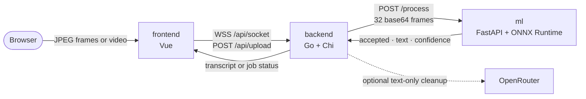

# Sigma Sign — Backend

**Go orchestration service for live and uploaded-video Russian Sign Language recognition.**

It accepts browser frames over WebSocket or a video over HTTP, builds fixed ML windows, stabilizes predictions, and exposes a two-layer live transcript: literal gestures immediately, then conservative phrase cleanup through OpenRouter.

**🇬🇧 English** · [🇷🇺 Русский](README.ru.md)

[](go.mod)
[](https://github.com/go-chi/chi)


**[Sigma Sign organization](https://github.com/HSE-SignLanguage)** · **[Frontend](https://github.com/HSE-SignLanguage/frontend)** · **[ML service](https://github.com/HSE-SignLanguage/ml)** · **[Live demo](https://hack.eferzo.xyz/)** · **[Swagger UI](https://hack.eferzo.xyz/swagger/index.html)**

---

## Role in the stack



The backend owns transport, load control and transcript state. The [ML service](https://github.com/HSE-SignLanguage/ml) owns frame validation and isolated-gesture inference; the [frontend](https://github.com/HSE-SignLanguage/frontend) owns camera capture, upload UX and rendering.

Two request paths share the same ML contract:

- **Realtime:** overlapping 32-frame windows with a 16-frame stride, latest-work replacement, two-window gesture confirmation, immediate raw gesture events, and ordered asynchronous phrase formatting.
- **Upload:** synchronous upload/`ffprobe` validation, bounded FFmpeg extraction, asynchronous inference, and polling through a UUID job ID.

## URL contract

Routes are registered at the service root. The production gateway exposes the API under `/api` and **strips that prefix** before forwarding to the backend.

| Purpose | Direct/local backend | Public deployment |
| --- | --- | --- |
| Health | `GET /health` | [`GET /api/health`](https://hack.eferzo.xyz/api/health) |
| Live frames | `WS /socket` | `WSS /api/socket` |
| Upload | `POST /upload` | `POST /api/upload` |
| Job status | `GET /job/{id}` | `GET /api/job/{id}` |
| Swagger UI | `GET /swagger/index.html` | [`GET /swagger/index.html`](https://hack.eferzo.xyz/swagger/index.html) |

The frontend defaults to same-origin `/api/`. A reverse proxy must preserve WebSocket upgrades for `/api/socket`. Swagger is exposed separately at `/swagger` because the UI loads `/swagger/doc.json`; `SWAGGER_BASE_URL` must contain the public API root, including its scheme and any proxy path, for example `https://hack.eferzo.xyz/api`.

The generated Swagger 2.0 document derives its `host`, `basePath` and scheme from that public URL, so "Try it out" uses the same route as external clients.

## API

All HTTP routes share a per-client limit of 20 requests per five seconds. Capacity responses use `429` or `503` and include `Retry-After` where the handler controls the overload.

### `GET /health`

Returns `200 OK` with plain-text body `OK`. It checks the backend process, not ML, object storage or OpenRouter readiness.

### `WS /socket`

Send one compressed image frame per **binary** WebSocket message. The current frontend sends JPEG at 24 FPS; the backend passes frame bytes to ML without decoding them itself.

Realtime behavior:

- 32-frame windows, stride 16;
- one pending ML window: a newer window replaces stale queued work;
- one global ML call at a time per backend process;
- every stable ML-accepted gesture is emitted immediately as a raw draft;
- the same gesture is suppressed until two rejected/`no` windows release it;
- draft gestures are grouped after about three idle seconds or six tokens;
- at most one OpenRouter formatter runs per connection while newer gestures remain visible as pending draft;
- one event loop owns ordered WebSocket output, so formatted segments cannot overtake one another.

Connection limits per backend process:

| Limit | Value |
| --- | ---: |
| Concurrent WebSockets | 8 global, 2 per canonical client IP |
| Binary message size | 512 KiB |
| Frame rate | 45 messages/second |
| Data rate | 4 MiB/second |
| Idle timeout | 45 seconds |
| Non-binary violations | closed after 3 |

The server sends three ordered event types. A stable gesture appears first, without waiting for OpenRouter:

```json
{
  "type": "gesture",
  "status": "draft",
  "text": "работать",
  "final_text": "",
  "draft_text": "я работать",
  "full_text": "я работать",
  "literal_text": "я работать",
  "confidence": 0.91,
  "sequence": 2,
  "segment_id": 1,
  "first_sequence": 2,
  "last_sequence": 2,
  "token_count": 1
}
```

When an idle/max-size boundary closes the segment, `type: "formatting"` announces the same snapshots and segment range. Completion produces either an enhanced segment or a deterministic literal fallback:

```json
{
  "type": "transcript",
  "status": "enhanced",
  "enhanced": true,
  "text": "Я работаю.",
  "final_text": "Я работаю.",
  "draft_text": "дом",
  "full_text": "Я работаю. дом",
  "literal_text": "я работать дом",
  "confidence": 0.87,
  "sequence": 2,
  "segment_id": 1,
  "first_sequence": 1,
  "last_sequence": 2,
  "token_count": 2
}
```

`full_text` is the authoritative rendered snapshot and always contains finalized presentation text plus every raw in-flight/pending gesture. `literal_text` independently preserves the recognizer-only stream, so an AI rewrite never replaces the source evidence. `final_text` contains completed ordered presentation segments; `draft_text` contains raw tokens still eligible for replacement. `text` and `confidence` keep their legacy shape, but clients must not blindly append `text` from every event; they should replace their visible state from `full_text`. On an OpenRouter error the final event has `status: "literal"`, `enhanced: false`, and commits the exact raw tokens, so already visible text never disappears. Long-lived sessions are bounded; `truncated: true` means the oldest finalized prefix was removed from both snapshots.

### `POST /upload`

Accepts `multipart/form-data`:

| Field | Required | Meaning |
| --- | --- | --- |
| `video` | yes | Video file, at most 100 MiB |
| `interval` | no | Minimum extraction interval, integer `1..120`; default `1` |

The request body is limited to 101 MiB and three minutes. Before returning a job ID, the backend saves the file under a UUID name and validates the actual video stream with `ffprobe` rather than trusting the filename or MIME type.

Accepted videos are limited to two minutes, at most 3840×2160-equivalent pixels, and at most 240 FPS. The effective interval is automatically increased when necessary so FFmpeg extracts no more than 960 square 448-pixel JPEG frames. The resulting ML windows use the same 32/16 layout as realtime; the final partial window is padded with its last frame.

At most two uploads are validated concurrently and one video job is processed at a time. Processing has a 15-minute deadline. A valid accepted request returns `202`:

```json
{
  "job_id": "550e8400-e29b-41d4-a716-446655440000",
  "status": "queued",
  "message": "Video upload accepted, processing started"
}
```

Relevant errors are `400` for invalid form fields, `408` for upload timeout, `413` for size, `415` for invalid/unsupported video, `429` when the video worker is busy, and `503` when upload validation capacity is full.

Example:

```bash
curl -fsS http://127.0.0.1:8080/upload \
  -F 'video=@./sample.mp4' \
  -F 'interval=1'

curl -fsS http://127.0.0.1:8080/job/550e8400-e29b-41d4-a716-446655440000
```

### `GET /job/{id}`

Returns `404` for an unknown ID. A known job contains:

- `status`: `queued`, `processing`, `completed`, or `failed`;
- frame and batch counters, including successful and failed batches;
- incremental `transcription` segments and final `full_text`;
- probed video metadata and the effective extraction interval;
- timestamps and, for a failed job, `error`.

A completed job may have empty `full_text` when ML was reachable but found no confident gesture. If every inference call fails, the job is marked failed instead of reporting a false success.

## Backend ↔ ML contract

`ML_API_URL` must address the ML service's `/process` endpoint. Each request contains exactly 32 base64-encoded image frames:

```json
{
  "frames": ["<base64-frame-1>", "<base64-frame-2>"],
  "count": 32
}
```

The array above is abbreviated; `count` and the actual array length are both 32.

The backend consumes this response shape:

```json
{
  "text": "привет",
  "confidence": 0.91,
  "accepted": true,
  "class_id": 42
}
```

For compatibility with the original ML API, a response containing only non-empty `text` is treated as accepted. The client accepts HTTP `200` or `202`, limits the response body, and retries only `429`/`503` up to two times with bounded `Retry-After` and jitter inside a 30-second request deadline.

## Optional OpenRouter cleanup

Recognition remains an ML decision. For live sessions, OpenRouter receives an immutable ordered group of at most six accepted literals (with backend-assigned sequence and confidence) plus up to the last 1000 Unicode characters of finalized context—never frames or the uploaded video.

Formatting is asynchronous and conservative: temperature zero, minimal reasoning effort, strict JSON Schema, echoed sequence validation, bounded request/response sizes, and a five-second timeout. Provider routing requires requested parameters, prefers latency, and allows failover. A response may return only the new segment; it cannot rewrite finalized context. Invalid, truncated, oversized, delayed/mismatched or unavailable output falls back to the exact literal segment. Uploaded-video jobs retain the legacy append-only per-literal cleanup contract.

Set `USE_OPENROUTER=false` to keep all transcript processing local to the backend and ML service.

## Configuration

The process loads `.env` from the working directory when present. Environment variables take precedence.

| Variable | Required / default | Purpose |
| --- | --- | --- |
| `BACKEND_PORT` | required; Compose uses `8080` | HTTP listen port |
| `ML_API_URL` | default `http://localhost:8085/process` | Complete internal ML `/process` URL |
| `USE_MOCK` | `false` | Return deterministic mock predictions without calling ML |
| `USE_OPENROUTER` | `true` | Enable conservative external transcript cleanup |
| `OPENROUTER_API_KEY` | required only when cleanup is enabled | OpenRouter bearer credential; never commit it |
| `OPENROUTER_MODEL` | required only when cleanup is enabled | Model supporting strict JSON Schema; `.env.example` contains a current example |
| `SWAGGER_BASE_URL` | `http://localhost:${BACKEND_PORT}` | Public API root used by Swagger, for example `https://hack.eferzo.xyz/api` |
| `TRUSTED_PROXY_CIDRS` | empty | Comma-separated CIDRs of direct trusted reverse proxies |

`TRUSTED_PROXY_CIDRS` is a security boundary. Forwarded headers are ignored unless the immediate peer is trusted; then the rightmost untrusted `X-Forwarded-For` address is used. `True-Client-IP` and `X-Real-IP` are never trusted. Use the narrow ingress/overlay CIDR that actually reaches the container, not an arbitrary broad private range. Leave it empty when connecting directly in local development.

## Run locally

Requirements:

- Go 1.25 or newer (CI and the Docker build currently use Go 1.26.5);
- FFmpeg and `ffprobe` for `/upload`;
- a reachable [Sigma Sign ML service](https://github.com/HSE-SignLanguage/ml), unless `USE_MOCK=true`;
- optional OpenRouter credentials, unless `USE_OPENROUTER=false`.

Create `.env` from [`.env.example`](.env.example). A minimal backend-only development configuration is:

```env
BACKEND_PORT=8080
ML_API_URL=http://localhost:8085/process
TRUSTED_PROXY_CIDRS=
USE_MOCK=true
USE_OPENROUTER=false
```

Then run:

```bash
go mod download
go run .
```

Verify it:

```bash
curl -fsS http://127.0.0.1:8080/health
```

For real inference, start the ML repository on port 8085, set `USE_MOCK=false`, and keep `ML_API_URL=http://localhost:8085/process`. Configure OpenRouter separately only if required.

Local Swagger UI is at [http://localhost:8080/swagger/index.html](http://localhost:8080/swagger/index.html). Regenerate committed docs after changing annotations with the version pinned by this repository:

```bash
go run github.com/swaggo/swag/cmd/swag@v1.16.6 init -g main.go --output ./docs
```

## Docker

The repository compose file starts **only the backend**. For a standalone smoke test, set `USE_MOCK=true` and `USE_OPENROUTER=false` in `.env`, then run:

```bash
docker compose config
docker compose up --build
curl -fsS http://127.0.0.1:8080/health
```

For the real stack, attach backend and ML to the same private Docker/Dokploy network and set `ML_API_URL` to stable service DNS, for example `http://ml:8085/process`. `localhost` inside the backend container points back to the backend container and cannot reach a separate ML container.

The runtime image includes FFmpeg, runs as UID/GID 10001, and has a health check. Compose binds the development port to loopback, drops Linux capabilities, enables `no-new-privileges`, makes the root filesystem read-only, and mounts a bounded `tmpfs` for uploads and extracted frames.

## Tests and CI

Run the same checks used by CI:

```bash
go test -race ./...
go vet ./...
go build ./...
```

The GitHub Actions workflow runs on pushes to `main` and pull requests with a 15-minute job timeout. Tests cover strict segment formatting, two-layer live ordering/snapshots/fallback, ML response/retry behavior, prediction stabilization, trusted-proxy resolution, video-job capacity, and exact/padded frame windowing.

The real OpenRouter integration test is opt-in by the presence of both `OPENROUTER_API_KEY` and `OPENROUTER_MODEL`. Remove those variables from the root `.env`—empty entries still count as present for this test—when an offline test run is intended.

## Security and reliability guardrails

- per-IP HTTP rate limiting and canonical, trusted-proxy-aware client addresses;
- global/per-IP WebSocket caps, frame/rate/idle limits and bounded latest-frame queues;
- serialized ML access and bounded retry behavior for transient overload;
- upload body/read deadlines, UUID temp paths, `0600` files, filename sanitization and `ffprobe` validation;
- duration, resolution, frame-count, worker and job-time limits around FFmpeg;
- bounded ML/OpenRouter response bodies, strict schema/sequence validation, and literal fallback;
- non-root, read-only container runtime with dropped capabilities and bounded temporary storage;
- panic recovery, HTTP server timeouts, structured logs, graceful HTTP shutdown and automatic cleanup of completed in-memory jobs after 24 hours.

## Deployment checklist

- Route public `/api` to backend `/` with **Strip Path enabled** and WebSocket upgrades preserved.
- Route public `/swagger` to backend `/swagger` if Swagger should be exposed.
- Build the frontend with same-origin `/api/`, or add an explicit gateway/CORS design before using another origin.
- Set `ML_API_URL` to internal service DNS; do not expose ML inference publicly unless separately protected.
- Set exact `TRUSTED_PROXY_CIDRS` for the ingress network and ensure the proxy appends or overwrites forwarding headers safely.
- Store OpenRouter credentials as deployment secrets. Disable OpenRouter if transcript text must not leave the private stack.
- Give the ML service enough startup time and memory to load its model; backend health alone does not prove ML readiness.
- Keep deployment stop grace time above the backend's ten-second HTTP shutdown budget, while accounting for the limitations below.

## Known limitations

- The API has no authentication or authorization. Protect it at the gateway when videos or transcripts are sensitive.
- There is no CORS middleware; the supported browser deployment is same-origin through `/api`.
- Jobs and transcript state are in memory. A backend restart loses job status/results, and per-process limits are not shared across replicas.
- `http.Server.Shutdown` does not drain upgraded WebSockets or detached upload workers; deployments interrupt active live sessions and jobs.
- The global ML slot and single upload worker intentionally favor stability over throughput. Busy instances return `429`/`503`.
- OpenRouter formatting cannot repair an incorrectly recognized gesture; failed live segments commit their accepted raw literals.

This repository does not currently include a license file; reuse terms are therefore not yet defined.
