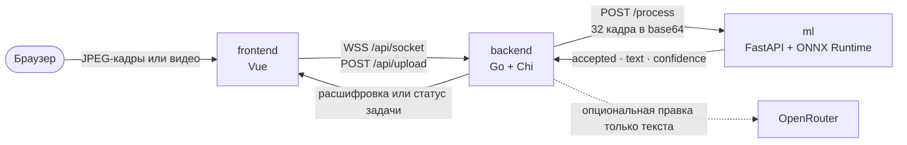

# Sigma Sign — Backend

**Сервис оркестрации на Go для распознавания русского жестового языка в live-режиме и из загруженного видео.**

Он принимает кадры из браузера по WebSocket или видео по HTTP, формирует фиксированные окна для ML, стабилизирует предсказания и выдаёт двухслойную live-расшифровку: жесты сразу, затем консервативную правку фразы через OpenRouter.

[🇬🇧 English](README.md) · **🇷🇺 Русский**

[](go.mod)
[](https://github.com/go-chi/chi)


**[Организация Sigma Sign](https://github.com/HSE-SignLanguage)** · **[Frontend](https://github.com/HSE-SignLanguage/frontend)** · **[ML-сервис](https://github.com/HSE-SignLanguage/ml)** · **[Live demo](https://hack.eferzo.xyz/)** · **[Swagger UI](https://hack.eferzo.xyz/swagger/index.html)**

---

## Роль в системе



Backend отвечает за транспорт, ограничение нагрузки и состояние расшифровки. [ML-сервис](https://github.com/HSE-SignLanguage/ml) проверяет кадры и распознаёт отдельные жесты, а [frontend](https://github.com/HSE-SignLanguage/frontend) управляет камерой, загрузкой и отображением результата.

Два сценария используют единый ML-контракт:

- **Realtime:** перекрывающиеся окна по 32 кадра с шагом 16, замена устаревшей работы свежей, подтверждение жеста на двух окнах, немедленные raw-события и асинхронное форматирование фраз по порядку.
- **Upload:** синхронная загрузка и проверка через `ffprobe`, ограниченное извлечение кадров FFmpeg, асинхронный инференс и опрос по UUID задачи.

## Контракт URL

Внутри сервиса маршруты зарегистрированы от корня. Публичный gateway выставляет API под `/api` и **удаляет этот префикс** перед передачей запроса в backend.

| Назначение | Прямой/local backend | Публичный деплой |
| --- | --- | --- |
| Health | `GET /health` | [`GET /api/health`](https://hack.eferzo.xyz/api/health) |
| Live-кадры | `WS /socket` | `WSS /api/socket` |
| Загрузка | `POST /upload` | `POST /api/upload` |
| Статус задачи | `GET /job/{id}` | `GET /api/job/{id}` |
| Swagger UI | `GET /swagger/index.html` | [`GET /swagger/index.html`](https://hack.eferzo.xyz/swagger/index.html) |

Frontend по умолчанию использует same-origin `/api/`. Reverse proxy должен сохранять WebSocket upgrade для `/api/socket`. Swagger публикуется отдельно на `/swagger`, потому что UI загружает `/swagger/doc.json`; `SWAGGER_BASE_URL` должен содержать публичный корень API вместе со схемой и путём reverse proxy, например `https://hack.eferzo.xyz/api`.

Сгенерированный документ Swagger 2.0 берёт `host`, `basePath` и схему из этого публичного URL, поэтому «Try it out» использует тот же маршрут, что и внешние клиенты.

## API

Для всех HTTP-маршрутов действует общий лимит: 20 запросов от клиента за пять секунд. При нехватке ёмкости используются `429` или `503`; обработчики добавляют `Retry-After`, когда управляют этой перегрузкой.

### `GET /health`

Возвращает `200 OK` и plain-text `OK`. Проверяется только процесс backend, но не готовность ML, объектного хранилища или OpenRouter.

### `WS /socket`

Отправляйте один сжатый кадр в каждом **binary** WebSocket message. Текущий frontend передаёт JPEG с частотой 24 FPS; backend сам не декодирует кадры, а пересылает байты в ML.

Поведение realtime-конвейера:

- окна по 32 кадра, шаг 16;
- одно ожидающее ML-окно: более свежая работа заменяет устаревшую;
- один общий ML-вызов одновременно на процесс backend;
- каждый стабильный принятый ML-жест публикуется сразу как raw draft;
- повтор того же жеста подавляется до двух отклонённых окон или `no`;
- draft-жесты группируются примерно после трёх секунд паузы или шести токенов;
- на соединение работает не больше одного formatter OpenRouter, а новые жесты сразу видны в pending draft;
- один event loop единолично отправляет события WebSocket, поэтому готовые сегменты не нарушают порядок.

Лимиты на процесс backend:

| Лимит | Значение |
| --- | ---: |
| Одновременные WebSocket | 8 всего, 2 на канонический IP клиента |
| Размер binary message | 512 KiB |
| Частота кадров | 45 сообщений/с |
| Поток данных | 4 MiB/с |
| Таймаут простоя | 45 секунд |
| Non-binary нарушения | закрытие после 3 |

Сервер отправляет три упорядоченных типа событий. Стабильный жест появляется первым и не ждёт OpenRouter:

```json
{
  "type": "gesture",
  "status": "draft",
  "text": "работать",
  "final_text": "",
  "draft_text": "я работать",
  "full_text": "я работать",
  "literal_text": "я работать",
  "confidence": 0.91,
  "sequence": 2,
  "segment_id": 1,
  "first_sequence": 2,
  "last_sequence": 2,
  "token_count": 1
}
```

Когда пауза или лимит размера закрывает сегмент, `type: "formatting"` объявляет те же snapshots и диапазон сегмента. После обработки приходит улучшенный текст или детерминированный literal fallback:

```json
{
  "type": "transcript",
  "status": "enhanced",
  "enhanced": true,
  "text": "Я работаю.",
  "final_text": "Я работаю.",
  "draft_text": "дом",
  "full_text": "Я работаю. дом",
  "literal_text": "я работать дом",
  "confidence": 0.87,
  "sequence": 2,
  "segment_id": 1,
  "first_sequence": 1,
  "last_sequence": 2,
  "token_count": 2
}
```

`full_text` — авторитетный snapshot для отображения: завершённый оформленный текст плюс все raw-жесты in-flight/pending. `literal_text` независимо сохраняет только результат распознавания, поэтому ИИ-редактура не заменяет исходные свидетельства. `final_text` содержит завершённые оформленные сегменты по порядку, `draft_text` — raw-токены, которые ещё могут быть заменены. `text` и `confidence` сохраняют прежнюю форму, но клиент не должен слепо дописывать `text` из каждого события: видимое состояние нужно заменять значением `full_text`. При ошибке OpenRouter финальное событие получает `status: "literal"`, `enhanced: false` и фиксирует точные raw-токены, поэтому уже показанный текст не исчезает. Долгие сессии ограничены по памяти; `truncated: true` означает, что самый старый завершённый префикс удалён из обоих snapshots.

### `POST /upload`

Принимает `multipart/form-data`:

| Поле | Обязательное | Значение |
| --- | --- | --- |
| `video` | да | Видеофайл размером не более 100 MiB |
| `interval` | нет | Минимальный интервал извлечения, целое `1..120`; по умолчанию `1` |

Тело запроса ограничено 101 MiB и тремя минутами. До возврата ID задачи backend сохраняет файл под UUID-именем и проверяет реальный видеопоток через `ffprobe`, не доверяя имени файла или MIME-типу.

Принимаются видео длительностью до двух минут, с числом пикселей не больше эквивалента 3840×2160 и частотой до 240 FPS. Эффективный интервал автоматически увеличивается, чтобы FFmpeg извлёк не более 960 квадратных JPEG-кадров размером 448 пикселей. ML-окна используют ту же схему 32/16, что realtime; последнее неполное окно дополняется последним кадром.

Одновременно проверяются не более двух загрузок и обрабатывается одна video job. На обработку отводится 15 минут. Корректный принятый запрос возвращает `202`:

```json
{
  "job_id": "550e8400-e29b-41d4-a716-446655440000",
  "status": "queued",
  "message": "Video upload accepted, processing started"
}
```

Основные ошибки: `400` для некорректных полей формы, `408` для таймаута загрузки, `413` для размера, `415` для неподдерживаемого или повреждённого видео, `429`, когда video worker занят, и `503`, когда исчерпана ёмкость проверки загрузок.

Пример:

```bash
curl -fsS http://127.0.0.1:8080/upload \
  -F 'video=@./sample.mp4' \
  -F 'interval=1'

curl -fsS http://127.0.0.1:8080/job/550e8400-e29b-41d4-a716-446655440000
```

### `GET /job/{id}`

Для неизвестного ID возвращается `404`. Известная задача содержит:

- `status`: `queued`, `processing`, `completed` или `failed`;
- счётчики кадров и батчей, включая успешные и неуспешные;
- инкрементальные сегменты `transcription` и итоговый `full_text`;
- метаданные видео и фактический интервал извлечения;
- временные метки и поле `error` для неуспешной задачи.

У завершённой задачи `full_text` может быть пустым, если ML был доступен, но не нашёл уверенного жеста. Если завершились ошибкой все вызовы инференса, задача помечается как failed, а не выдаёт ложный успех.

## Контракт Backend ↔ ML

`ML_API_URL` должен указывать на `/process` ML-сервиса. Каждый запрос содержит ровно 32 изображения в base64:

```json
{
  "frames": ["<base64-frame-1>", "<base64-frame-2>"],
  "count": 32
}
```

Массив выше сокращён: и `count`, и реальная длина массива равны 32.

Backend использует следующие поля ответа:

```json
{
  "text": "привет",
  "confidence": 0.91,
  "accepted": true,
  "class_id": 42
}
```

Для совместимости с исходным ML API ответ только с непустым `text` считается принятым. Клиент принимает HTTP `200` или `202`, ограничивает размер ответа и повторяет только `429`/`503` не более двух раз с ограниченными `Retry-After` и jitter в рамках 30-секундного deadline всего запроса.

## Опциональная правка через OpenRouter

Решение о распознавании всегда принимает ML. В live-сессии OpenRouter получает неизменяемую упорядоченную группу не более чем из шести принятых literals (с назначенными backend sequence и confidence) и до 1000 последних Unicode-символов завершённого контекста — без кадров и загруженного видео.

Форматирование асинхронно и консервативно: нулевая температура, минимальный reasoning effort, строгая JSON Schema, проверка возвращённых sequence, ограниченные размеры запросов/ответов и таймаут пять секунд. Маршрутизация provider требует поддержку параметров, предпочитает минимальную задержку и разрешает failover. Ответ может вернуть только новый сегмент и не может переписать завершённый контекст. При некорректном, обрезанном, слишком большом, запоздавшем/несовпавшем или недоступном ответе фиксируется точный literal-сегмент. Для загруженных видео сохраняется прежний append-only per-literal контракт правки.

Для загруженного видео корректный ответ с пустым `delta` считается намеренным no-op: существующая расшифровка не меняется, а сомнительный literal не добавляется. Literal fallback применяется только при ошибке formatter-запроса или нарушении append-only контракта в ответе.

Установите `USE_OPENROUTER=false`, чтобы вся обработка расшифровки оставалась внутри backend и ML-сервиса.

## Конфигурация

При наличии процесс загружает `.env` из рабочей директории. Переменные окружения имеют приоритет.

| Переменная | Обязательность / default | Назначение |
| --- | --- | --- |
| `BACKEND_PORT` | обязательна; Compose использует `8080` | HTTP-порт сервиса |
| `ML_API_URL` | default `http://localhost:8085/process` | Полный внутренний URL ML `/process` |
| `USE_MOCK` | `false` | Детерминированные mock-предсказания без вызова ML |
| `USE_OPENROUTER` | `true` | Включить консервативную внешнюю правку текста |
| `OPENROUTER_API_KEY` | только при включённой правке | Bearer credential OpenRouter; не коммить |
| `OPENROUTER_MODEL` | только при включённой правке | Модель со строгой JSON Schema; в `.env.example` есть актуальный пример |
| `SWAGGER_BASE_URL` | `http://localhost:${BACKEND_PORT}` | Публичный корень API для Swagger, например `https://hack.eferzo.xyz/api` |
| `TRUSTED_PROXY_CIDRS` | пусто | CIDR непосредственных доверенных reverse proxy через запятую |

`TRUSTED_PROXY_CIDRS` — граница безопасности. Forwarded headers игнорируются, пока непосредственный peer не входит в trusted CIDR; после этого используется крайний справа недоверенный адрес из `X-Forwarded-For`. Заголовки `True-Client-IP` и `X-Real-IP` не считаются доверенными. Указывайте узкий CIDR реальной ingress/overlay-сети, достигающей контейнера, а не произвольную широкую приватную сеть. При прямом local-подключении оставляйте значение пустым.

## Локальный запуск

Требования:

- Go 1.25 или новее (CI и Docker build сейчас используют Go 1.26.5);
- FFmpeg и `ffprobe` для `/upload`;
- доступный [ML-сервис Sigma Sign](https://github.com/HSE-SignLanguage/ml), если не используется `USE_MOCK=true`;
- опциональные credentials OpenRouter, если не используется `USE_OPENROUTER=false`.

Создайте `.env` по образцу [`.env.example`](.env.example). Минимальная конфигурация для разработки только backend:

```env
BACKEND_PORT=8080
ML_API_URL=http://localhost:8085/process
TRUSTED_PROXY_CIDRS=
USE_MOCK=true
USE_OPENROUTER=false
```

Запустите:

```bash
go mod download
go run .
```

Проверьте:

```bash
curl -fsS http://127.0.0.1:8080/health
```

Для реального инференса запустите репозиторий ML на порту 8085, установите `USE_MOCK=false` и оставьте `ML_API_URL=http://localhost:8085/process`. OpenRouter настраивается отдельно только при необходимости.

Локальный Swagger UI: [http://localhost:8080/swagger/index.html](http://localhost:8080/swagger/index.html). После изменения аннотаций пересоздайте закоммиченные docs версией, закреплённой в репозитории:

```bash
go run github.com/swaggo/swag/cmd/swag@v1.16.6 init -g main.go --output ./docs
```

## Docker

Compose-файл репозитория запускает **только backend**. Для отдельного smoke test установите в `.env` `USE_MOCK=true` и `USE_OPENROUTER=false`, затем выполните:

```bash
docker compose config
docker compose up --build
curl -fsS http://127.0.0.1:8080/health
```

Для реального стека подключите backend и ML к одной приватной сети Docker/Dokploy и задайте в `ML_API_URL` стабильное DNS-имя сервиса, например `http://ml:8085/process`. `localhost` внутри backend-контейнера указывает на этот же контейнер и не позволяет обратиться к отдельному ML-контейнеру.

Runtime-образ включает FFmpeg, работает как UID/GID 10001 и имеет health check. Compose публикует development-порт только на loopback, удаляет Linux capabilities, включает `no-new-privileges`, делает root filesystem read-only и подключает ограниченный `tmpfs` для загрузок и извлечённых кадров.

## Тесты и CI

Запустите те же проверки, что используются в CI:

```bash
go test -race ./...
go vet ./...
go build ./...
```

GitHub Actions запускается для push в `main` и pull request с 15-минутным таймаутом job. Тесты покрывают строгий segment formatter, корректный OpenRouter no-op в отличие от error fallback, порядок/snapshots/fallback двухслойного live-текста, согласованный shutdown, ML-ответы и retry, стабилизацию предсказаний, trusted proxy, ёмкость video jobs и точные/padded окна кадров.

Реальный integration test OpenRouter включается при наличии одновременно `OPENROUTER_API_KEY` и `OPENROUTER_MODEL`. Удалите эти переменные из корневого `.env` — пустые значения всё равно считаются присутствующими для этого теста, — если нужен полностью offline test run.

## Защита и стабильность

- HTTP rate limit на IP и канонические адреса клиентов с учётом только доверенных proxy;
- централизованные response headers `nosniff`, защиты от clickjacking, ограничения referrer и browser permissions, включая Swagger и ответы с ошибками;
- общие и per-IP лимиты WebSocket, ограничения кадров/скорости/простоя и bounded latest-frame queues;
- последовательный доступ к ML и ограниченные retry временной перегрузки;
- лимиты тела и времени загрузки, UUID temp paths, файлы `0600`, очистка имени и проверка через `ffprobe`;
- ограничения длительности, разрешения, числа кадров, workers и времени jobs вокруг FFmpeg;
- ограничения ответов ML/OpenRouter, строгая валидация schema/sequence и literal fallback;
- непривилегированный read-only container с удалёнными capabilities и ограниченным временным хранилищем;
- panic recovery, HTTP timeouts, структурированные логи, согласованный drain WebSocket/upload и автоматическое удаление завершённых in-memory jobs через 24 часа.

## Чек-лист деплоя

- Направьте публичный `/api` в `/` backend с включённым **Strip Path** и сохранением WebSocket upgrade.
- Направьте публичный `/swagger` в `/swagger` backend, если Swagger должен быть доступен извне.
- Собирайте frontend с same-origin `/api/` либо явно проектируйте gateway/CORS перед использованием другого origin.
- Задайте `ML_API_URL` через внутреннее DNS-имя сервиса; не публикуйте ML inference без отдельной защиты.
- Укажите точные `TRUSTED_PROXY_CIDRS` ingress-сети и убедитесь, что proxy безопасно добавляет или перезаписывает forwarding headers.
- Храните credentials OpenRouter в deployment secrets. Отключите OpenRouter, если текст расшифровки не должен выходить за пределы приватного стека.
- Дайте ML достаточно времени и памяти на загрузку модели; health backend не означает готовность ML.
- Установите deployment stop grace time больше 30-секундного бюджета backend shutdown (рекомендуется не меньше 35 секунд). Во время drain новые WebSocket/upload отклоняются, live-сокеты сразу закрываются, активным video jobs даётся большая часть бюджета на завершение, после чего оставшиеся ML/OpenRouter/FFmpeg-вызовы отменяются с запасом времени на очистку.

## Известные ограничения

- В API нет аутентификации и авторизации. При чувствительных видео или расшифровках защищайте его на gateway.
- CORS middleware отсутствует; поддерживаемый browser-деплой использует same-origin `/api`.
- Jobs и состояние расшифровки находятся в памяти. Рестарт backend теряет статусы/результаты, а per-process лимиты не разделяются между репликами.
- Graceful shutdown не переносит активную live-сессию между репликами. Сокет получает `Going Away`, после чего клиент должен переподключиться; video jobs, не уложившиеся в bounded drain, отменяются, а их in-memory статус исчезает при завершении процесса.
- Один общий ML slot и один upload worker намеренно предпочитают стабильность throughput. Занятый инстанс возвращает `429`/`503`.
- Форматирование OpenRouter не способно исправить неверно распознанный жест; при ошибке live-сегмент фиксирует принятые raw literals.

В репозитории пока нет файла лицензии, поэтому условия повторного использования ещё не определены.
